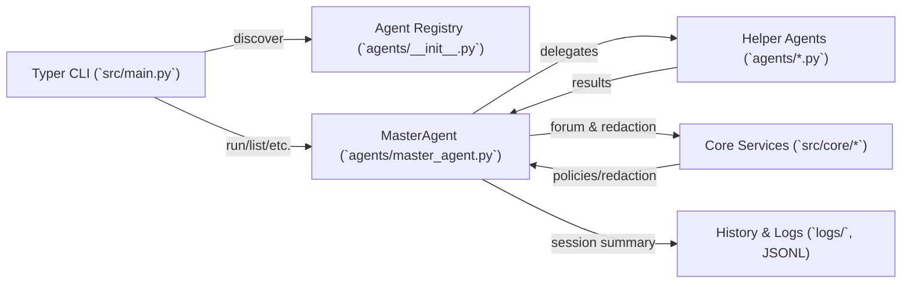
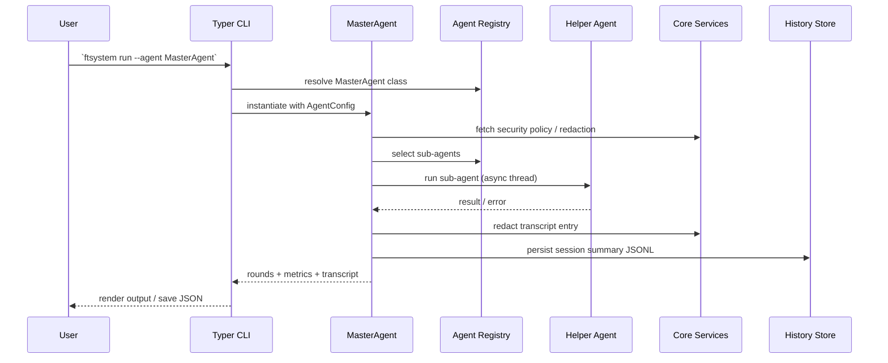

# ftSystem Architecture Overview

This document captures a high-level view of the ftSystem platform after the 2025‑10‑22 refresh (docstrings, typing, logging).

## Component Diagram

## Orchestration Sequence

## Notes

- Critical paths now emit debug-level logging around agent selection, rounds, and configuration overlays.
- Policies (`SecurityPolicy`) derived from environment variables are evaluated on each run, so tests can safely modify `FTSYSTEM_ALLOWED_AGENTS`.
- All diagrams are intentionally lightweight (Mermaid) to keep them versionable and easy to modify.
- Optional metrics export via `--metrics-path` uses Prometheus format and captures per-subagent latency/success for monitoring.
- Performance profiling (`perf profile`) offers quick benchmarking of orchestrations; combine with CLI `--lang` (en/pl) for localized output during demos.
